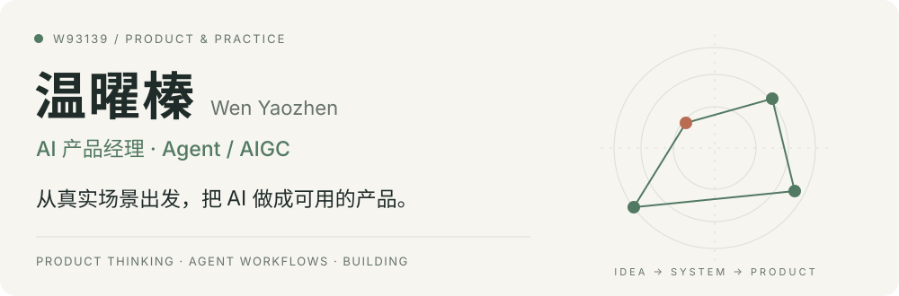

<picture>
  <source media="(prefers-color-scheme: dark) and (max-width: 600px)" srcset="assets/hero-dark-mobile.svg">
  <source media="(prefers-color-scheme: dark)" srcset="assets/hero-dark.svg">
  <source media="(max-width: 600px)" srcset="assets/hero-light-mobile.svg">
  
</picture>

  <a href="#selected-work">精选项目</a> &nbsp; / &nbsp;
  <a href="#research">产品研究</a> &nbsp; / &nbsp;
  <a href="#about">关于我</a> &nbsp; / &nbsp;
  <a href="mailto:yzz93139@gmail.com">联系我 ↗</a>

我是温曜榛，也叫 **快慢刀**。关注 AI、故事，以及它们能一起创造的新体验。

## 精选项目 / Selected work

<table>
  <tr>
    <td width="50%" valign="top">
      01 / AI STORYTELLING
      <h3><a href="https://github.com/w93139/ai-jubensha-fusion">人生海海 · AI 剧本杀 ↗</a></h3>
      
基于开源项目扩展的单真人 AI 剧本杀。规则引擎管理流程与证据权限，AI 演绎其余角色。

      
AI 游戏 · 规则引擎 · 角色交互

    </td>
    <td width="50%" valign="top">
      02 / AI REWRITING
      <h3>AI 剧本改写</h3>
      
从原稿理解出发，围绕情节、人物与文风做二次创作；通过人工复核，让改写服务于故事表达与可玩性。

      
OCR · 内容结构化 · Agent 改写

    </td>
  </tr>
  <tr>
    <td width="50%" valign="top">
      03 / LOCAL-FIRST TOOLS
      <h3><a href="https://github.com/w93139/token-usage-monitor">Token Usage Monitor ↗</a></h3>
      
本地优先的 macOS 菜单栏应用与 Codex 插件，让任务 Token、额度窗口与 API 用量更直观。

      
macOS · 用量可视化 · Codex

    </td>
    <td width="50%" valign="top">
      04 / DISCOVERY
      <h3><a href="https://github.com/w93139/github-radar">GitHub Radar ↗</a></h3>
      
发现 GitHub 新项目，用本地快照追踪候选项目增长；提供 Codex 插件与 macOS 浏览界面。

      
项目发现 · 增长快照 · 只读分析

    </td>
  </tr>
  <tr>
    <td width="50%" valign="top">
      05 / AGENT SYSTEMS
      <h3><a href="https://github.com/w93139/agent-blueprint">Agent Blueprint ↗</a></h3>
      
从 PRD 推导 Agent 架构与代码骨架，包含 17 个 Harness 组件参考实现、项目模板与测试。

      
PRD → 架构 · Harness · 参考实现

    </td>
    <td width="50%" valign="top">
      06 / PRODUCT RESEARCH
      <h3><a href="https://github.com/w93139/ai-product-teardown">AI Product Teardown ↗</a></h3>
      
从真实界面与操作证据拆解 AI 产品，梳理用户旅程、Agent 契约、上下文流转与架构设计。

      
产品研究 · 交互证据 · 架构分析

    </td>
  </tr>
</table>

## 关于我 / A little about me

- **喜欢故事，也喜欢把它做出来。** 从人物、情节到人与 AI 的互动，既关心表达，也愿意动手验证想法。
- **习惯从真实场景出发。** 先看人们怎么用、哪里不顺，再决定该做什么。
- **爱拆解，也爱复用。** 把复杂问题拆成清楚的步骤，把有用的方法做成下一次还能用的工具。
- **对新东西保持好奇，对结果保持认真。** 尝试新模型和新工作流，也回看证据、反馈与实际效果。

## 产品研究 / Research

我会区分可观察的事实、基于证据的推断，以及自己的设计建议。

- **[MetaSight 产品拆解 ↗](https://w93139.github.io/metasight-product-teardown/)** — 从用户旅程与证据台账，分析 Agent 契约、架构和商业化。
- **[OiiOii 产品架构研究 ↗](https://w93139.github.io/oiioii-product-architecture/)** — 从交互截图出发，梳理创作流程、Agent 分工与资产流转。

更多方法与工具

- [geo-automation-skills](https://github.com/w93139/geo-automation-skills) — 从关键词、写作到平台适配的 GEO 内容工作流。
- [create-prd-skill](https://github.com/w93139/create-prd-skill) — 以证据和明确需求为基础，创建与审查 PRD。
- [rag-eval-workflow](https://github.com/w93139/rag-eval-workflow) — 用黄金数据集、回归检查和领域规则评估检索效果。
- [safe-find-skills](https://github.com/w93139/safe-find-skills) — Agent Skill 的发现与安全审查工作流。
- [coding-workflow](https://github.com/w93139/coding-workflow) — 明确范围、实施、验证与独立审查的开发工作流。

---

  <b>聊聊 AI 产品、Agent 工作流，或一个值得做的想法。</b> 
  <a href="mailto:yzz93139@gmail.com">yzz93139@gmail.com ↗</a>

理解场景 · 做出产品 · 持续验证

