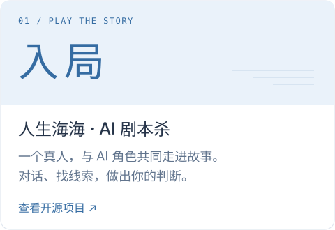
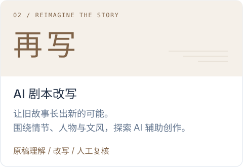

<a href="#stories">
  <picture>
    <source media="(prefers-color-scheme: dark) and (max-width: 600px)" srcset="assets/terminal-dark-mobile.svg">
    <source media="(prefers-color-scheme: dark)" srcset="assets/terminal-dark.svg">
    <source media="(max-width: 600px)" srcset="assets/terminal-light-mobile.svg">
    
  </picture>
</a>

## 故事与 AI

  <a href="https://github.com/w93139/ai-jubensha-fusion">
    <picture>
      <source media="(prefers-color-scheme: dark)" srcset="assets/play-dark.svg">
      
    </picture>
  </a>
  <a href="https://github.com/w93139/juben-workbench">
    <picture>
      <source media="(prefers-color-scheme: dark)" srcset="assets/rewrite-dark.svg">
      
    </picture>
  </a>

## Vibe Coding

- **[EchoMere 洄映](https://github.com/w93139/echomere)** — AI对话 传统命理与自我探索
- **[Token Usage Monitor](https://github.com/w93139/token-usage-monitor)** — MacOS Token监测
- **[GitHub Radar](https://github.com/w93139/github-radar)** — 发掘GitHub新项目
- **[Agent Blueprint](https://github.com/w93139/agent-blueprint)** — Agent搭建蓝图
- **[AI Product Teardown](https://github.com/w93139/ai-product-teardown)** — 产品项目拆解

更多方法与工具

[GEO 内容工作流](https://github.com/w93139/geo-automation-skills) · [PRD 创作与审查](https://github.com/w93139/create-prd-skill) · [RAG 评测](https://github.com/w93139/rag-eval-workflow) · [Skill 安全审查](https://github.com/w93139/safe-find-skills) · [开发工作流](https://github.com/w93139/coding-workflow)

## 关于我

「快看世界 慢想答案」

对故事有耐心，对新东西有好奇心。 
喜欢拆解复杂问题，也喜欢做出能用的小东西。 
相信好想法值得动手，好产品需要回到真实场景。

<a href="https://w93139.github.io/Jyn-Website/">
  <picture>
    <source media="(prefers-color-scheme: dark)" srcset="assets/contact-dark.svg">
    
  </picture>
</a>

## 研究手记

- **[MetaSight 产品拆解 ↗](https://w93139.github.io/metasight-product-teardown/)** — 用户旅程、Agent 契约与商业化分析。
- **[OiiOii 产品架构研究 ↗](https://w93139.github.io/oiioii-product-architecture/)** — 从交互证据理解创作流程与 Agent 分工。

---
